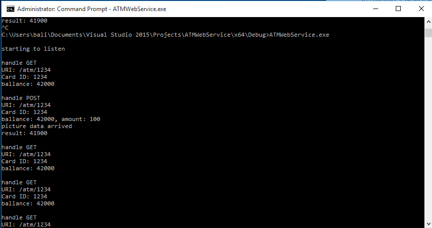
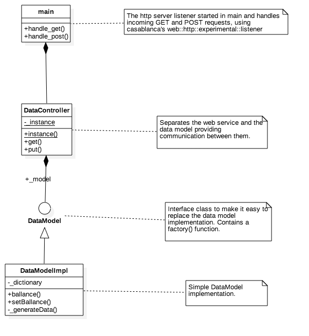
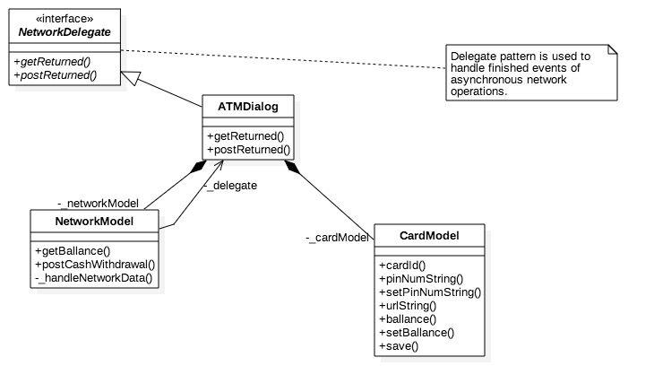

#### ATM client/RESTful asynchronous web server/client example written in C++.

##### Client:

A very simple ATM client built on Qt.  Source is located in the "Client
project/" directory.

[](https://youtu.be/syqdhQlfcVI "ATM client")

The client forward some requests to the web server and reacts to the responses.
I had no chance to learn MFC from zero in 3 days so I chose Qt which I used 16
years ago last time (signal-slot still the same as it was in Qt 2 :) ).
.cardinfo must be copied to the user’s home folder.  .cardinfo is a JSon config
file which contains some basic config values for a card. "Url":
"http://192.168.0.101/atm/" line must contain the address of the server with /
atm/ suffix which is mandatory (at both sides).  I developed the client on Mac.
Unfortunately I could not compile casablanca on Mac (although it should work by
the docs) so I could not use it on the client side.

##### Server:

Win64 C++ RESTful web service to accept and execute bankcard operation requests.
Source is located in the "Server project/" directory.



ATMWebService.exe: The server exe on a windows machine is a pure windows command
line app. On Windows 10 it must be run with admin rights as it accepts
connections from any network address on port
80. I also had to turn off firewall. It generates the test data from the code,
so no config file for it. Compiled into
%PROJECTS%\ATMWebService\x64\[Debug|Release]\ATMWebService.exe In VS 2015 I
used cpprest-..desktop-..140 nu package which is casablanca 2.6.

##### Used Design Patterns:
###### Server:

- Singleton
- Factory method
- Strategy
- Web version of Model-View-Controller

###### Client:

- Model-View-Controller (ATMDialog is the main Controller and also the main
  view, the subviews are controlled from this class.
- 2 different model classes are used (CardModel for card info and NetworkModel
  for network/http communication). The ATMDialog also connects these two models
as they are independent from each other.
- Delegate Pattern. It is the Mac style delegate pattern (observer pattern
  restricted to one observer object). NetworkModel notifies its delegate via the
NetworkDelegate interface (@protocol in ObjC). ATMDialog implements this
protocol to be able to handle finished events.

```
Copyright (c) 2015 Balazs Kilvady

Permission is hereby granted, free of charge, to any person obtaining a copy of
this software and associated documentation files (the "Software"), to deal in
the Software without restriction, including without limitation the rights to
use, copy, modify, merge, publish, distribute, sublicense, and/or sell copies of
the Software, and to permit persons to whom the Software is furnished to do so,
subject to the following conditions:

The above copyright notice and this permission notice shall be included in all
copies or substantial portions of the Software.

THE SOFTWARE IS PROVIDED "AS IS", WITHOUT WARRANTY OF ANY KIND, EXPRESS OR
IMPLIED, INCLUDING BUT NOT LIMITED TO THE WARRANTIES OF MERCHANTABILITY, FITNESS
FOR A PARTICULAR PURPOSE AND NONINFRINGEMENT. IN NO EVENT SHALL THE AUTHORS OR
COPYRIGHT HOLDERS BE LIABLE FOR ANY CLAIM, DAMAGES OR OTHER LIABILITY, WHETHER
IN AN ACTION OF CONTRACT, TORT OR OTHERWISE, ARISING FROM, OUT OF OR IN
CONNECTION WITH THE SOFTWARE OR THE USE OR OTHER DEALINGS IN THE SOFTWARE.
```
